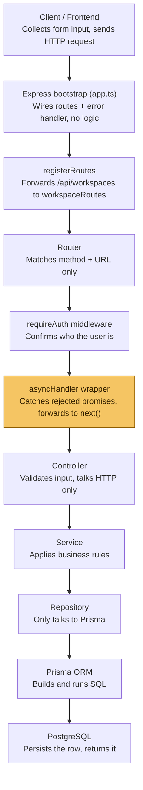
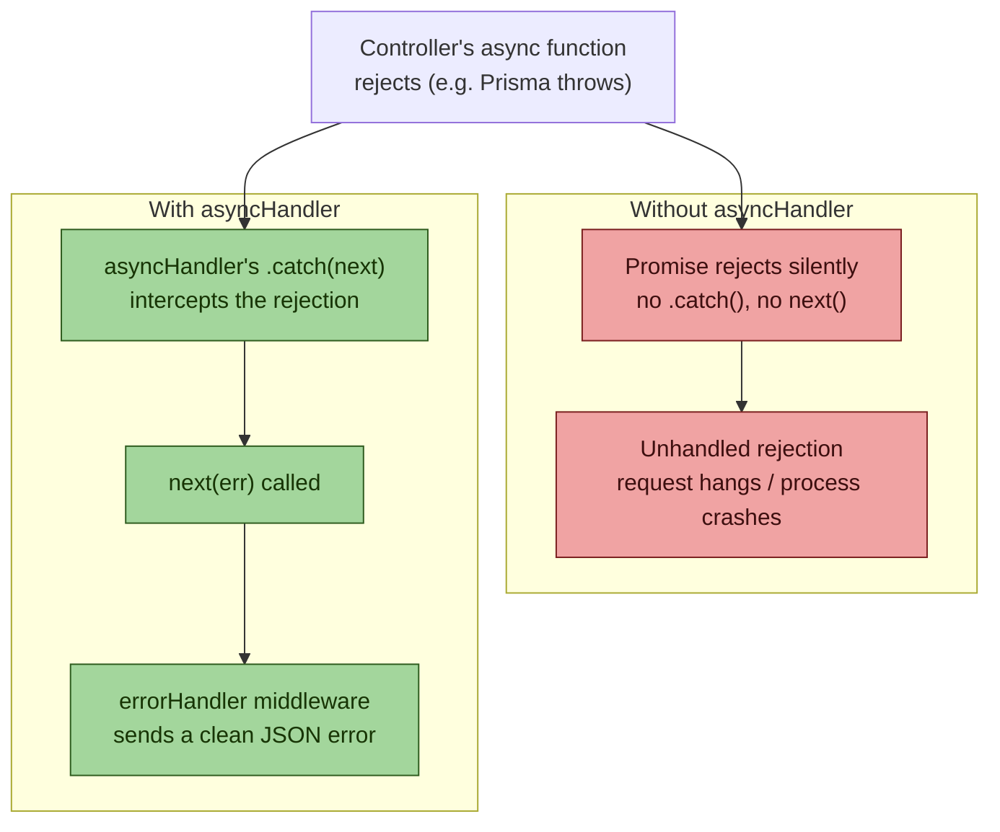
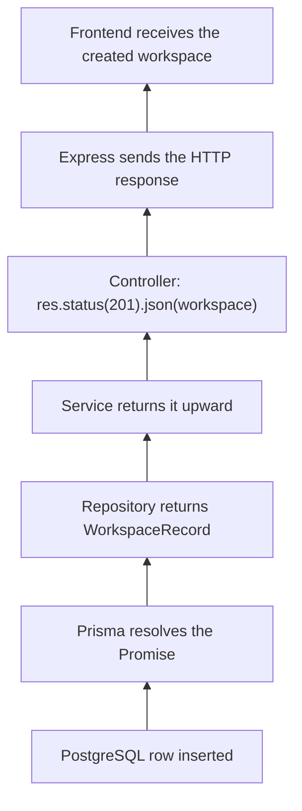

# Create Workspace — Full Request Lifecycle

A mental model for how a scalable, layered backend (Express + Prisma + Postgres) handles
one request, from the browser to the database and back.

The core idea to hold onto: **every layer has exactly one job and does not know how the
other layers do theirs.** The controller doesn't know SQL. The repository doesn't know
HTTP. The router doesn't know business rules. That separation is *why* the system scales —
you can change, test, or replace any one layer without touching the rest.

---

## 1. The full pipeline at a glance



Each arrow is a **hand-off**, not a merge — the layer below never needs to know who called
it, only what shape of input it receives and what shape of output it must return.

---

## 2. Stage-by-stage breakdown

### 1 — Client / Frontend
```json
{ "title": "NotebookLM", "description": "My AI Notes", "icon": "📚", "defaultModel": "gpt-4o-mini" }
```
- **Job:** collect user input, fire `POST /api/workspaces` with body + session cookie.
- **Must not:** validate business rules, touch a database, know about Prisma.
- **Output:** an HTTP request — nothing more.

### 2 — Express bootstrap (`app.ts`)
```ts
const app = express();
registerRoutes(app);
app.use(errorHandler);
```
- **Job:** wire the app together once, at startup. Register routes, mount middleware,
  attach the error handler last.
- **Must not:** contain business logic. This file only answers "what exists," never "what
  happens."

### 3 — Route registration
```ts
app.use("/api/workspaces", workspaceRoutes);
```
- **Job:** keep routes modular by feature instead of dumping everything into `app.ts`.
- **Output:** Express now knows any `/api/workspaces/*` request goes to `workspaceRoutes`.

### 4 — Router matches the URL
```ts
workspaceRoutes.post("/", requireAuth, asyncHandler(createWorkspace));
```
- **Job:** match method (`POST`) + path (`/`) — that's it.
- Once matched, Express walks the middleware chain **left to right** before the controller
  ever runs.

### 5 — `requireAuth` middleware
- **Job:** workspace APIs are private, so before anything else happens, figure out *who*
  is making this request.
- Validates session / JWT / cookie, then attaches `req.session.user.id` so downstream
  code can trust it.
- **On failure:** calls `next(new AppError(401))` — skips straight to the error handler,
  never reaches the controller.

### 6 — `asyncHandler` wraps the controller
*(See the dedicated section below — this is the part worth really understanding.)*

### 7 — Controller layer
```ts
const input = parseCreateBody(req.body);       // createWorkspaceSchema.safeParse()
const workspace = await createWorkspaceForUser(req.session.user.id, input);
res.status(201).json(workspace);
```
- **Job:** HTTP only — parse the request, call the service, shape the response.
- **Must not:** know SQL, know Prisma, contain business rules.
- Never trust client input — validation with `zod` (or similar) happens right here,
  before anything crosses into the service layer.

### 8 — Service layer
```ts
async function createWorkspaceForUser(userId, input) { /* business rules */ }
```
- **Job:** the *business rules* — can this user create another workspace? apply defaults,
  enforce plan limits, check permissions.
- **Decides WHAT should happen.** The repository below only decides HOW to query for it.

### 9 — Repository layer
```ts
function createWorkspaceRecord(userId, data) {
  return prisma.workspace.create({ data: { ...data, userId } }); // no await — see below
}
```
- **Job:** talk to the database and nothing else. No validation, no HTTP, no business logic.
- **Why no `await`?** The repository has nothing left to do with the result — it just
  hands the still-pending `Promise<WorkspaceRecord>` straight back up the chain. Awaiting
  here would only delay the return by one microtask for no benefit.

### 10 — Prisma ORM
- **Job:** turn the JS call into SQL, open a connection, run the query.
- Because DB I/O takes real time, Prisma returns a `Promise` immediately and resolves it
  once Postgres responds — this is exactly why every layer above it has to be `async`.

### 11 — PostgreSQL
```sql
INSERT INTO "Workspace" (...) VALUES (...) RETURNING *;
```
- **Job:** durably store the row, return the newly created record.

---

## 3. Deep dive: why `asyncHandler` exists

Express predates widespread `async/await`. It knows how to catch **synchronous** throws
inside a route handler automatically — but it has **no idea** what a rejected `Promise`
is. If your controller is `async function createWorkspace(req, res)` and something inside
throws, that becomes a rejected promise, not a synchronous exception Express can see.



**The wrapper itself:**
```ts
const asyncHandler = (fn) => (req, res, next) => {
  void fn(req, res, next).catch(next);
};

// usage
workspaceRoutes.post("/", asyncHandler(createWorkspace));
```

**Without it**, every single controller would need this boilerplate repeated by hand:
```ts
async function createWorkspace(req, res, next) {
  try {
    // ...logic
  } catch (err) {
    next(err); // easy to forget — and forgetting it means a silently hanging request
  }
}
```

**With it**, that `try/catch` is written exactly once, centrally, and every async
controller gets it for free just by being passed through `asyncHandler`. This is a
textbook example of **DRY (don't repeat yourself) applied to error handling** — a small
wrapper that eliminates an entire category of bugs (unhandled rejections) across the whole
codebase, forever, with zero per-route effort.

---

## 4. The response travels back up the same chain



Notice it's a **mirror image** of the way down — nothing skips a layer in either
direction. That symmetry is what makes each layer independently testable: mock the layer
directly below you, and you can unit-test everything above it in isolation.

---

## 5. Mental model — the five rules to keep in your head

1. **One request, one direction, one layer at a time.** Client → Router → Middleware →
   Controller → Service → Repository → DB, and back up the exact same path.
2. **Each layer has a single responsibility and refuses to know about the others'.**
   Controller = HTTP. Service = business rules. Repository = queries. Mixing these is the
   #1 way layered architectures rot over time.
3. **Validate at the edge, trust after that.** Input is untrusted only until the
   controller's schema check passes — every layer past that point can assume it's clean.
4. **Async code needs an explicit safety net.** Express won't catch rejected promises for
   you; `asyncHandler` (or `try/catch` in every controller) is not optional, it's
   structural.
5. **Errors are just another return path, not a special case.** `next(err)` routes a
   failure through the same funnel (`errorHandler`) regardless of which layer it came
   from — auth, controller, service, or database.
